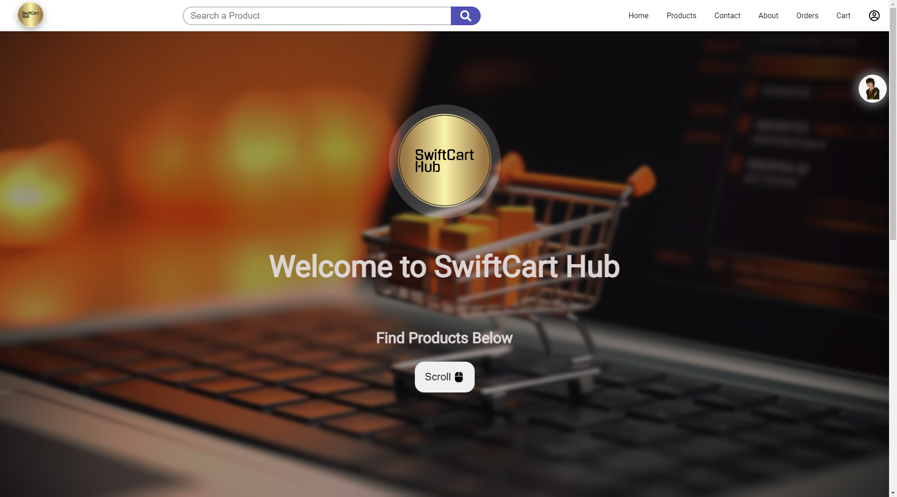

# SwiftCart Hub
SwiftCart Hub is a full-stack eCommerce application built with Vite, React.js, Node.js, and MongoDB. This project allows users to browse products, add items to their cart, and make purchases. It also includes an admin dashboard for managing products, orders, and users.

## Features 
- User authentication and authorization (Login and SIgnup)
- Reset Password and Forget Password functionality for users
- Product catalog with category filtering ( ex. price, search keywords, product category and ratings)
- Shopping Cart functionality and Order management
- Payment functionality (using Stripe)
- Admin dashboard for product, order, and user management
- Responsive design

## Tech Stack
**Frontend**:
- Vite React.js
- React-Redux/ ReduxJSToolkit (for state management)

**Backend**:
- Node.js
- Express.js
- MongoDB 

**Third Party Services**:
- Cloudinary

## Installation
### Prerequisites
Make sure you have the following installed:
- Node.js (v16 or higher)
- MongoDB (Compass)

### Step 1: Clone the repository:
- `git clone` 

### Step 2: Install dependencies for both frontend and backend:
- `cd frontend`
 `npm install`

- `cd ../backend`
 `npm install`

### Step 3: Set up environment variables:

Create a `.env` file in the `backend` folder and add values accordingly the following variables:

`PORT=`
`DB_URL =`
`COOKIE_EXPIRE =`
`JWT_SECRET = `
`JWT_EXPIRE = `
`SMPT_SERVER =` 
`SMPT_MAIL = `
`SMPT_PASSWORD =` 
`SMPT_HOST = `
`SMPT_PORT = `
`CLOUDINARY_NAME = `
`CLOUDINARY_API_KEY =`
`CLOUDINARY_API_SECRET = `
`FRONTEND_URL = `
`STRIPE_API_KEY = `
`STRIPE_SECRET_KEY =`

### Step3: Start the development servers:

- In the `backend` folder:
`npm run dev`

- In the `frontend` folder:
`npm run dev`

## Screenshots

### Homepage

